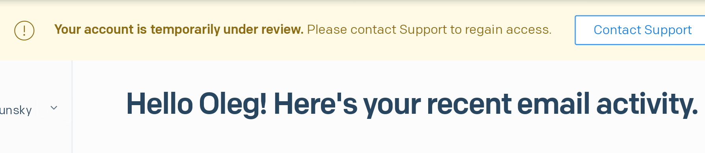

# Сендгрид мудаки, Постмарк молодцы

## Че за сендгрид?

А сендгрид — это btb-сервис для рассылки почты. Ну, то есть все эти "confirm your email address", "новости нашего сраного приложения"  и прочая почта обычно посылаются через таких ребят. Если не знаком конкретно сендгрид, есть ещё мейлган, мейлчимп, постмарк - наверняка что-то слышали.

Сендгрид год назад был куплен твилио, компанией с многомиллиардной капитализацией. Сириуз бизнес, можно положиться на таких ребят.

## А вы че?

В Чатре, помимо "ресет ёр пассворд", есть несколько функций, плотно завязанных на отсылку емейлов: в чате это отправка непрочитанных ответов саппорта на почту посетителю, симметричная штука — отправка непрочитанных сообщений посетителя на почту саппорта; в почте это, собственно, отправка почтовых сообщений от саппорта.

Все это до недавнего времени работало через сендгрид.

## А он чё?

И вот одним прекрасным вечером, часов так в 11, у нас падают прод тесты на отправку емейлов.

Тут надо сказать, что письма через сендгрид могли зачастую идти пару минут, а иногда и больше. И в тесте у нас была трехминутная пауза перед проверкой почты, но и она не всегда спасала, были ложные фейлы тестов, но почта в итоге доходила.

Если подумать, то это ужасная скорость доставки, особенно если при регистрации требуется подтвердить емейл. Но мы не требуем сразу подтвердить емейл, поэтому в нашем процессе регистрации это не было узким местом.

Я залезаю в телефоне, чтобы убедиться, что срабатывание ложное. Но нет, почта все ещё не дошла. Регистрирую новый акк в Чатре - письмо не приходит. Рефрешу почту минут 5. Блять.

Встаю, чешу жопу и иду за комп. Лезу в сендгрид и вижу это:

Что, блядь? Эти уебки просто взяли и заблочили нам почту? Мы шлем миллионы сообщений в месяц, платим этим мудакам дохуя денег, у нас в их собственной системе рейтинга 98% "всё охуенно, вы совсем не спамер", и они просто блокируют нам отсылку почты в продакшене без предупреждений.

В саппорт-чат моментально улетает вопрос "какого хуя" (более культурными словами, так как пишу не я), на что саппорт мнется и отвечает, что наш вопрос очень важен, ай хэв эливейтед ёр тикет приорити. Тикет приорити при этом остаётся где-то в районе "неоч срочно", саппорт откровенно пиздит. На любые дополнительные вопросы саппорт кормит нас голубцами с говном.

Через пару часов становится понятно, что ребята в сендгриде массируют свои соски от нашего баттхерта,

и в ближайшее время ничего не решится, надо что-то делать самим.

Мы вспоминаем, что по счастливой случайности у нас завалялся ещё один аккаунт сендгрида для сайдпроектов.

Он не заблочен, достаточно поменять апи-ключ, чтобы отправить туда весь поток наших емейлов, но это стремно по двум причинам:

1. Мы до сих пор не знаем, какого хуя нас забанили. Не хочется стриггерить бан и на втором аккаунте и потерять любую возможность быстро восстановить отправку почты.
2. Резкая отправка почты с нового аккаунта с шейред айпи-адресов (ссылочка) может сильно просадить доставляемость почты, потому что почтовики привыкли получать нашу почту с наших выделенных айпи, оставшихся в основном акке. (Если вы не понимаете, о чем речь, добро пожаловать в ебанутый мир суперлегаси технологии, обмазанной невероятными костылями, — электронной почты)

На второй пункт сейчас в целом насрать, потому что какая-то доставляемость лучше никакой доставляемости. Но получить второй бан от сервиса, платящим, сука блядь, ~~клиентом~~ заложником которого ты являешься, стремно.

В течение ночи я плавно перевожу почту частями на запасной акк. К утру весь функционал восстанавливается, акк не забанен, ура, блядь. Ухожу спать.

## А дальше чё?

Через 16 часов аккаунт все ещё забанен, и в тикете тишина. И без этого очевидно, что от этих мудаков надо срочно валить, но то, насколько им просто похуй на платящих клиентов, просто смешно. Ни один клиент не останется клиентом после 16 часов бана, но они и не собираются останавливаться. Что у них там, блядь, происходит?

## Ну а вы чё?

Пока я изучал альтернативы, Тёме кто-то подсказал попробовать постмарк, а он редиректнул этот совет мне.

После такого факапа я изучил буквально всё про постмарк: чё за компания, чё за основатели, сколько клиентов, сколько зарабатывают, прочитал весь их сайт.

Чуваки оставляют очень приятное ощущение того, что их ебет, что они делают.

- Они гордятся скоростью доставки почты и показывают реплтаймовые данные на ленде.
- они показывают рейтинг саппорта и обещают отвечать в течение пары часов
-  Они очень парятся за свою репутацию как отправителя, и поэтому строго разделяют транзакционные письма и почтовые рассылки (настолько строго, что до недавнего времени вообще не занимались почтовыми рассылками, а теперь старого разделяют, шлют с отдельного пула айпи и очень рекомендуют использовать для них отдельный поддомен)
- они не пытаются развести на покупку выделенных айпи и прямо говорят, что большинству выделенные айпи не нужны, а шейред айпи с хорошим рейтингом будут работать на доставляемость почты гораздо лучше.

И ещё то, что меня сильно зацепило: они прямо на ленде пишут, что они privately owned and profitable. И вот почему.

Блядские черные дыры для инвестиций

Большинство силиконоводолинных компаний сейчас развиваются не ради пользователей, а ради инвесторов. 

Кажется, что если развивать продукт для пользователей, пользователи кинут в вас деньгами, будет прибыль, инвесторы будут рады и тоже кинут в вас деньгами на дальнейшее развитие.

На практике сейчас все работает не так. Задача компании - показать инвесторам не прибыль, а потенциал прибыли. Инвесторы радостно это кушают и продолжают кидать деньгами в компанию, остающуюся убыточной десятилетиями.

Компания получает инвесторские деньги, CEO покупает себе новый макларен, а на оставшиеся деньги максимально раздувается пользовательская база, чтобы можно было показать растущий потенциал инвесторам, чтобы они занесли ещё денег. Круг замыкается.

При этом компания скупает рекламу ковровой бомбардировкой, и ей совершенно не важно, что цена привлечения пользователя в продукт может в разы превышать средний livetime value привлечённого пользователя.

От этого страдают компании, которые живут на прибыль (ого, так бывает?), потому что они не могут соревнования в цене за клик по рекламе с ковровыми бомбардировщиками. Но это уже другая история.

Как вы уже догадались, сендгрид - именно такая компания-мразь, существующая не для клиента, а для инвестора. Ей совершенно поебать на тебя, клиент ебаный. Твой энтерпрайз-тариф - копейки по сравнению с очередным раундом инвестиций.

## Ага, и че, перешли на постмарк?

Да, в течение пары дней после инцидента я перевел всю почту на постмарк.

...

А сендгрид-то разбанил?

...

Сендгрид давно летит по наклонной

## И как постмарк?

Вы знаете, кажется, заебись. Мы перешли на них в течение пары дней после инцидента, пользуемся уже больше месяца и всем довольны.

Саппорт действительно отвечает очень быстро, и отвечает не очередной агент 2487. Отвечает человек, который разбирается в продукте и в почте в целом, у него есть все необходимые доступы ко всем внутренним инструментам, чтобы тебе помочь, и он прям берет и помогает. Не создает тебе тикет, не эскалирует его, а прям отвечает тебе сразу. Выглядит это все, конечно, совсем не серьезно, недостаточно бюрократично и энтерпрайзно, но мы как-нибудь переживём. В конце концов, у нас в Чатре вот прям такой же саппорт для людей.

, фичи, видимость.

А че сендгид-то
